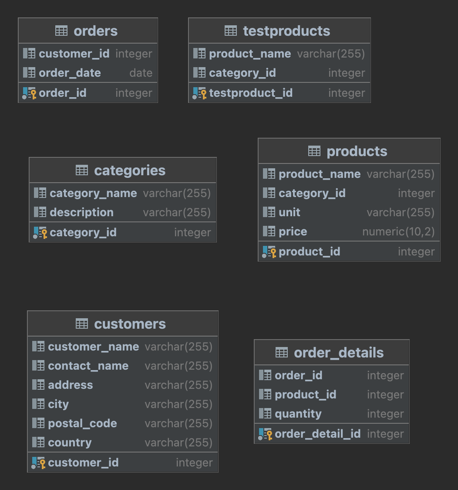

# Graph QL Spring demo ordering application
This repository contains demo application, made around free demo database from https://www.w3schools.com/postgresql/postgresql_create_demodatabase.php.

## What is this for?
Target of this tiny project is to try out myself different aspects of GraphQL API and test out Spring approach to implementing it.
It can be expanded with ease to test more advanced concepts as well.

## Data
Given database provides small but sufficient relational DB schema with sample data, that I leverage to create small backend application around.
Structure of the data is quite in compliance with GraphQLs strengths and allows for nice and clear examples of its usage.

Missing foreign keys and other constrains in the demo DB makes no problem, since scope of this demo is limited.